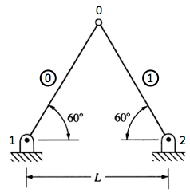

.. _Assembly1:

Assembly, Part I
================

Overview
--------

Assembly is the process of merging element equations in to their
corresponding locations in the global equations. The assembler described
constructs and merges one element at a time and adopts the following
assumptions:

-  nodes are ordered continuously from :math:`0\rightarrow n-1`, where
   :math:`n` is the total number of nodes,

-  the number and type of degrees of freedom at each node is the same,

-  there are no multifreedom constraints, and

-  the global stiffness matrix is stored as a full symmetric matrix.

Assembly by Example
-------------------

Consider the truss in Figure [fig:ass.truss.1], each node has two
degrees of freedom (translation in the :math:`x` and :math:`y`
directions), giving :math:`3` nodes :math:`\times` 2 DOF/node = 6 DOF
for the structure. The array of global displacements :math:`\{u\}` is
organized as

.. math::

   \label{eq:ass.ug.1}
     \{u\} = \begin{Bmatrix}
       u_x^0 \\ u_y^0 \\ u_x^1 \\ u_y^1 \\ u_x^2 \\ u_y^2
     \end{Bmatrix} =
     \begin{Bmatrix}
       u_0 \\ u_1 \\ u_2 \\ u_3 \\ u_4 \\ u_5
     \end{Bmatrix}

The associated global stiffness is a :math:`6\times6` matrix that we
initialize with zeros:

   Example two element truss.

.. math::

   \label{ass.K.1}
     \left[K\right] = \begin{bmatrix}
       0 & 0 & 0 & 0 & 0 & 0\\
       0 & 0 & 0 & 0 & 0 & 0\\
       0 & 0 & 0 & 0 & 0 & 0\\
       0 & 0 & 0 & 0 & 0 & 0\\
       0 & 0 & 0 & 0 & 0 & 0\\
       0 & 0 & 0 & 0 & 0 & 0
     \end{bmatrix}

Element 0 joins nodes 0 and 1. From , the local-to-global-DOF mapping
for nodes 0 and 1 is:

+--------+-------------+--------------+
| Node   | Local DOF   | Global DOF   |
+========+=============+==============+
| 0      | :math:`x`   | 0            |
+--------+-------------+--------------+
| 0      | :math:`y`   | 1            |
+--------+-------------+--------------+
| 1      | :math:`x`   | 2            |
+--------+-------------+--------------+
| 1      | :math:`y`   | 3            |
+--------+-------------+--------------+

The global degrees of freedom of an element are collected in the element
freedom table: . The element stiffness matrix :math:`\left[k^0\right]`
is a fully populated matrix given on the left below with the element
freedom table entries marking the columns and rows. The result of
merging the element stiffness :math:`\left[k^0\right]` in to the global
stiffness :math:`\left[K\right]` is shown on the right.

.. math::

   \label{ass.k1.1}
     \stackrel{\begin{matrix}
         \hphantom{k_{11}^0} &
         \hphantom{k_{12}^0} &
         \hphantom{k_{13}^0} &
         \hphantom{k_{14}^0} \\ 0 & 1 & 2 & 3 \end{matrix}}{
     \begin{bmatrix}
       k_{11}^0 & k_{12}^0 & k_{13}^0 & k_{14}^0 \\
       k_{21}^0 & k_{22}^0 & k_{23}^0 & k_{24}^0 \\
       k_{31}^0 & k_{32}^0 & k_{33}^0 & k_{34}^0 \\
       k_{41}^0 & k_{42}^0 & k_{43}^0 & k_{44}^0
     \end{bmatrix}}\begin{matrix}0\\1\\2\\3\end{matrix} \longrightarrow
     \stackrel{\begin{matrix}
         \hphantom{k_{11}^0} &
         \hphantom{k_{12}^0} &
         \hphantom{k_{13}^0} &
         \hphantom{k_{14}^0} &
         \hphantom{0} &
         \hphantom{0} \\ 0 & 1 & 2 & 3 & 4 & 5 \end{matrix}}{
     \begin{bmatrix}
       k_{11}^0 & k_{12}^0 & k_{13}^0 & k_{14}^0 & 0 & 0 \\
       k_{21}^0 & k_{22}^0 & k_{23}^0 & k_{24}^0 & 0 & 0\\
       k_{31}^0 & k_{32}^0 & k_{33}^0 & k_{34}^0 & 0 & 0\\
       k_{41}^0 & k_{42}^0 & k_{43}^0 & k_{44}^0 & 0 & 0\\
       0 & 0 & 0 & 0 & 0 & 0\\
       0 & 0 & 0 & 0 & 0 & 0
     \end{bmatrix}}\begin{matrix}0\\1\\2\\3\\4\\5\\ \end{matrix}

The local-to-global-DOF mapping can be generalized as:

.. math::

   \label{eq:ass.mapping}
     \text{GLOBAL DOF} = \text{NUMBER OF DOF PER NODE}\times\text{NODE
       NUMBER} + \text{LOCAL DOF}

:math:`\text{LOCAL DOF}` is one of the following integers:

+--------------------+-------------+
| DOF description    | LOCAL DOF   |
+====================+=============+
| :math:`x`          | 0           |
+--------------------+-------------+
| :math:`y`          | 1           |
+--------------------+-------------+
| :math:`z`          | 2           |
+--------------------+-------------+
| :math:`\theta_x`   | 3           |
+--------------------+-------------+
| :math:`\theta_y`   | 4           |
+--------------------+-------------+
| :math:`\theta_z`   | 5           |
+--------------------+-------------+
| :math:`T`          | 6           |
+--------------------+-------------+

Applying to Element 1, the element freedom table is and
:math:`\left[k^1\right]` and :math:`\left[K\right]` are:

.. math::

   \label{eq:ass.k1.2}
     \stackrel{\begin{matrix}
         \hphantom{k_{11}^0} &
         \hphantom{k_{12}^0} &
         \hphantom{k_{13}^0} &
         \hphantom{k_{14}^0} \\ 0 & 1 & 4 & 5 \end{matrix}}{
     \begin{bmatrix}
       k_{11}^1 & k_{12}^1 & k_{13}^1 & k_{14}^1 \\
       k_{21}^1 & k_{22}^1 & k_{23}^1 & k_{24}^1 \\
       k_{31}^1 & k_{32}^1 & k_{33}^1 & k_{34}^1 \\
       k_{41}^1 & k_{42}^1 & k_{43}^1 & k_{44}^1
     \end{bmatrix}}\begin{matrix}0\\1\\4\\5\end{matrix} \longrightarrow
     \stackrel{\begin{matrix}
         \hphantom{k_{11}^0+k_{11}^1} &
         \hphantom{k_{12}^0+k_{11}^1} &
         \hphantom{k_{13}^0} &
         \hphantom{k_{14}^0} &
         \hphantom{k_{11}^1} &
         \hphantom{k_{11}^1} \\ 0 & 1 & 2 & 3 & 4 & 5 \end{matrix}}{
     \begin{bmatrix}
       k_{11}^0+k_{11}^1 & k_{12}^0+k_{11}^1 & k_{13}^0 & k_{14}^0 & k_{13}^1 & k_{23}^1 \\
       k_{21}^0+k_{12}^1 & k_{22}^0+k_{22}^1 & k_{23}^0 & k_{24}^0 & k_{14}^1 & k_{24}^1 \\
       k_{31}^0 & k_{32}^0 & k_{33}^0 & k_{34}^0 & 0 & 0\\
       k_{41}^0 & k_{42}^0 & k_{43}^0 & k_{44}^0 & 0 & 0\\
       k_{31}^1 & k_{32}^1 & 0 & 0 & k_{33}^1 & k_{34}^1\\
       k_{41}^1 & k_{42}^1 & 0 & 0 & k_{43}^1 & k_{44}^1\\
     \end{bmatrix}}\begin{matrix}0\\1\\2\\3\\4\\5\\ \end{matrix}

[assembly] When assembling the global finite element stiffness, the
following questions must be answered in the affirmitive:

-  Is the value of :math:`K_{II}` equal to the sum of all elements
   connected to node :math:`I`?

-  Is the value of :math:`K_{IJ}`, :math:`I\ne J`, equal to the negative
   of all elements connecting nodes :math:`I` and :math:`J`?

-  Is the stiffness symmetric?

Looking at the global system in , it is clear that each of the three
preceding questions can be answered in the affirmitive.

Assembler Computational Implementation
--------------------------------------

Assemblers for the global stiffness and global force are presented.

Global Stiffness
~~~~~~~~~~~~~~~~

Assembly of the global stiffness is performed in , shown in Listing
[lst:ass.ass.1]. stands for “Uniform Degree of Freedom”. is defined in
and is invoked as

.. code:: python

    K = AssembleGlobalStiffnessUDOF(coord,elemap,eletyp,elecon,elemat,elefab)

The arguments to are:

+--------------+-----------------------------------------------------------------------------------------+
| ``coord``    | Nodal coordinates. is the ith coordinate of node n.                                     |
+--------------+-----------------------------------------------------------------------------------------+
| ``elemap``   | Element label map. is the internal node number of the external node label xelem.        |
+--------------+-----------------------------------------------------------------------------------------+
| ``elecon``   | Element connectivity. is the nth internal node label of element e.                      |
+--------------+-----------------------------------------------------------------------------------------+
| ``eletyp``   | Element types. is the element type of element .                                         |
+--------------+-----------------------------------------------------------------------------------------+
| ``elemat``   | Element material properties. is the nth material property of element e.                 |
+--------------+-----------------------------------------------------------------------------------------+
| ``elefab``   | Element fabrication properties. is the nth element fabrication property of element e.   |
+--------------+-----------------------------------------------------------------------------------------+

The output from is:

+---------+--------------------------------------------------------------------------------------------------------------------------------------------------------------------+
| ``K``   | Global stiffness matrix stored as a full (nd\*n, nd\*n) symmetric matrix, where nd is the number of degrees of freedom per node and n the total number of nodes.   |
+---------+--------------------------------------------------------------------------------------------------------------------------------------------------------------------+

.. code:: python

    def AssembleGlobalStiffnessUDOF(coord, elemap, eletyp, elecon, elemat,
                                    elefab, dltags=None, dlvals=None):
        coord, elecon = asarray(coord), asarray(elecon)
        # number of nodes and degrees of freedom per node
        numnod = coord.shape[0]
        ndof = NumberOfDOFPerNode(eletyp[0])
        # Default surface tags/values
        numele = elecon.shape[0]
        # compute the element stiffness and scatter to global array
        K = zeros((ndof*numnod, ndof*numnod))
        for (e, c) in enumerate(elecon):
            # Element stiffness
            c = c[:NodesPerElement(eletyp[e])]
            args = (coord[c], elemat[e], elefab[e])
            if dltags is not None:
                args += (dltags[e], dlvals[e])
            Ke = ElementStiffness(eletyp[e], *args)
            if Ke is None:
                xel = elemap.keys()[elemap.values().index(iel)]
                raise ValueError('Element %d has unkown element type' % xel)
            # GLOBAL DOF = NUMBER OF DOF PER NODExNODE NUMBER + LOCAL DOF
            eft = Flatten([[ndof*ni+i for i in range(ndof)] for ni in c])
            for i in range(Ke.shape[0]):
                ii = eft[i]
                for j in range(i, Ke.shape[0]):
                    jj = eft[j]
                    K[ii, jj] += Ke[i,j]
                    K[jj, ii] = K[ii, jj]
        return K

The subordinate function computes the element stiffness matrix. is shown
in Listing [lst:ass.elemstiff]. Details of each element stiffness are
presented in Appendix [app:elem.lib]. The heart of the assembly process
is constructing the element freedom table, represented by the symbol .
The element freedom table contains the global degree of freedom number
for the nodes in the element. For elements having uniform degrees of
freedom, this table can be constructed on the fly using . In , the
element freedom table is constructed by creating a nested list of global
DOF for each node on the element and flattening it. For example, for an
element having 2 degrees of freedom per node and having nodes and , the
element freedom table is formed by

.. code:: python

    def ElementStiffness(eletyp, *args):
        if eletyp in (L1D2, L2D2, L3D2):
            xc, E, A = args
            return Link2Stiffness(xc, E, A)
        elif eletyp == B1D2:
            xc, E, (A, Izz) = args
            return Beam2Stiffness(xc, E, (A, Izz))
        elif eletyp == B2D2:
            xc, E, (A, Izz) = args
            return BeamColumn2Stiffness(xc, E, (A, Izz))
        elif eletyp in (H2D3,):
            xc, k, A, dltags, dlvals = args
            Ke = HeatConductionStiffness(eletyp, xc, k)
            # Convection contribution
            for j in range(EdgesPerElement(eletyp)):
                if dltags[j] == QCONV:
                    Ke += HeatConvectionStiffness(eletyp, xc, j, dlvals[j,0])
            return Ke
        return None

Global Force
~~~~~~~~~~~~

Assembly of the global force is performed in , shown in Listing
[lst:ass.ass.2]. is defined in and is invoked as

.. code:: python

    F = AssembleGlobalForceUDOF(coord, elemap, eletyp, elecon, doftags, dofvals,
                                f=f, dltags=dltags, dlvals=dlvals)

The arguments to are

+---------------+----------------------------------------------------------------------------------------------------------------------------------------------------+
| ``coord``     | Nodal coordinates. is the ith coordinate of node n.                                                                                                |
+---------------+----------------------------------------------------------------------------------------------------------------------------------------------------+
| ``elemap``    | Element label map. is the internal node number of the external node label xelem.                                                                   |
+---------------+----------------------------------------------------------------------------------------------------------------------------------------------------+
| ``elecon``    | Element connectivity. is the nth internal node label of element e.                                                                                 |
+---------------+----------------------------------------------------------------------------------------------------------------------------------------------------+
| ``eletyp``    | Element types. is the element type of element .                                                                                                    |
+---------------+----------------------------------------------------------------------------------------------------------------------------------------------------+
| ``doftags``   | Degree of freedom tags. if the jth degree of freedom of node i has a known (prescribed) displacement, otherwise the node has a known force and .   |
+---------------+----------------------------------------------------------------------------------------------------------------------------------------------------+
| ``dofvals``   | Degree of freedom values. is the magnitude of the cooresponding to the prescribed condition indicated by .                                         |
+---------------+----------------------------------------------------------------------------------------------------------------------------------------------------+
| ``f``         | Node source. is the magnitude of the source contribution at a node.                                                                                |
+---------------+----------------------------------------------------------------------------------------------------------------------------------------------------+

The output from is:

+---------+-------------------------------------------------------------------------------------------------------------------------------------------+
| ``F``   | Global force array stored as a full nd\*n array, where nd is the number of degrees of freedom per node and n the total number of nodes.   |
+---------+-------------------------------------------------------------------------------------------------------------------------------------------+

.. code:: python

    def AssembleGlobalForceUDOF(coord, elemap, eletyp, elecon, doftags, dofvals,
                                f=None, dltags=None, dlvals=None):
        if doftags.ndim == 1:
            doftags = doftags.reshape(-1,1)
            dofvals = dofvals.reshape(-1,1)
        coord, elecon = asarray(coord), asarray(elecon)
        # number of nodes and degrees of freedom per node
        numnod = coord.shape[0]
        ndof = NumberOfDOFPerNode(eletyp[0])

        # Force contribution on Neummann boundary
        Q = array([dofvals[i,j] if doftags[i,j] == NEUMANN else 0.
                   for i in range(numnod) for j in range(ndof)])

        # compute contribution from element sources and boundary fluxes
        F = zeros(ndof*numnod)
        for (e, c) in enumerate(elecon):
            c = c[:NodesPerElement(eletyp[e])]
            fc = zeros(len(c)) if f is None else f[c]
            args = (coord[c], fc)
            if dltags is not None:
                args += (dltags[e], dlvals[e])
            Fe = ElementForce(eletyp[e], *args)
            if Fe is None:
                xel = elemap.keys()[elemap.values().index(iel)]
                raise ValueError('Element %d has unkown element type' % xel)

            # GLOBAL DOF = NUMBER OF DOF PER NODExNODE NUMBER + LOCAL DOF
            eft = Flatten([[ndof*ni+i for i in range(ndof)] for ni in c])
            for i in range(Fe.shape[0]):
                F[eft[i]] += Fe[i]

        return F, Q

The subordinate function computes the element force array due to sources
and distributed loads. is shown shown in Listing [lst:ass.elemforce].
Details of each element force are presented in Appendix [app:elem.lib].

.. code:: python

    def ElementForce(eletyp, *args):
        xc, f = args[:2]
        # Source array
        Fe = ElementSourceArray(eletyp, xc, f)
        if Fe is None:
            return None
        if eletyp == H2D3:
            dltags, dlvals = args[2:4]
            for j in range(EdgesPerElement(eletyp)):
                if dltags[j] == QCOND:
                    # evaluate the boundary flux contribution
                    Fe += ConductionFluxArray(eletyp, xc, j, dlvals[j])
                elif dltags[j] == QCONV:
                    # evaluate the convection contribution
                    Fe += ConvectionFluxArray(eletyp, xc, j, dlvals[j])
        return Fe

Verification of Program Units
-----------------------------

Assembly Verification
~~~~~~~~~~~~~~~~~~~~~

.. code:: python

    coord = [[0,0,0], [10,0,0], [10,10,0]]
    elemap = {1:0, 2:1, 3:2}
    elecon = [[0,1], [1,2], [0,2]]
    eletyp = [L3D2, L3D2, L3D2]
    elemat = [100] * 3
    elefab = [1, .5, 2*sqrt(2.)]
    K = AssembleGlobalStiffnessUDOF(coord,elemap,eletyp,elecon,elemat,elefab)
    assert(array([[ 20.,  10.,   0., -10.,   0.,   0., -10., -10.,   0.],
                  [ 10.,  10.,   0.,   0.,   0.,   0., -10., -10.,   0.],
                  [  0.,   0.,   0.,   0.,   0.,   0.,   0.,   0.,   0.],
                  [-10.,   0.,   0.,  10.,   0.,   0.,   0.,   0.,   0.],
                  [  0.,   0.,   0.,   0.,   5.,   0.,   0.,  -5.,   0.],
                  [  0.,   0.,   0.,   0.,   0.,   0.,   0.,   0.,   0.],
                  [-10., -10.,   0.,   0.,   0.,   0.,  10.,  10.,   0.],
                  [-10., -10.,   0.,   0.,  -5.,   0.,  10.,  15.,   0.],
                  [  0.,   0.,   0.,   0.,   0.,   0.,   0.,   0.,   0.]], K)

.. code:: python

    v = eigvals(K)
    assert([ 45.3577,16.74031,7.902,0.,0.,0.,0.,0.,0.], v)
