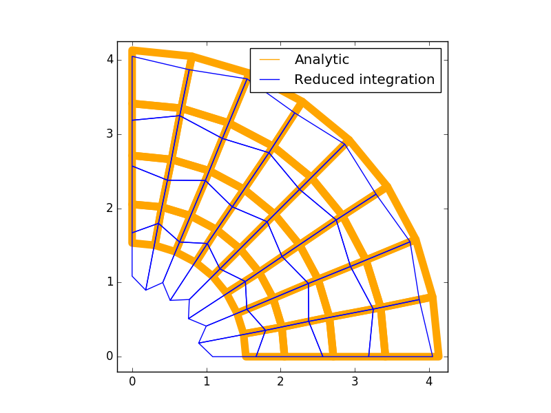

.. _ReducedIntegration:

Reduced integration elements
============================

.. raw:: html

   <h2> References </h2>

- `Applied Mechanics of Solids, Chapter 8 <http://solidmechanics.org/Text/Chapter8_6/Chapter8_6.php#Sect8_6_2>`__

Overview
--------

Reduced integration elements:

- form the element stiffness by integrating at fewer integration points than the standard;
- reduce the computational footprint of an element;
- reduce volumetric locking in quadratic elements; and
- suffer from "hourglassing" in linear elements.

Reduced integration
-------------------

The element stiffness :math:`\left[k^e\right]` is given by

.. math::

   \boldsymbol{k}_{ij} =
   \int_{\Omega^e}\boldsymbol{B}_i^T\boldsymbol{D}\boldsymbol{B}_j\, d\Omega

The concept behind reduced integration elements is straight forward: integrate
the element stiffness using a reduced order of numerical quadrature (typically
one order less accurate than standard). Typical choices for the number of
reduced integration points for various element types are

+----------------------------------+------------------+----------------+----------------------+
|                                  | Displacement     | Full Gaussian  |  Reduced Gaussian    |
|                                  | interpolation    | quadrature     |  quadrature          |
+----------------------------------+------------------+----------------+----------------------+
| .. image:: TriaReduced.png       | Linear           | 1 point        |  1 point             |
+----------------------------------+------------------+----------------+----------------------+
| .. image:: QuadReduced.png       | Bilinear         | 2x2            |  1 point             |
+----------------------------------+------------------+----------------+----------------------+
| .. image:: Quad8Reduced.png      | Quadratic        | 3x3            |  2x2                 |
+----------------------------------+------------------+----------------+----------------------+

Due to the reduced computational footprint of reduced integration elements,
they enjoy widespread adoption in most production finite element codes.

Reduced integration elements and volumetric locking
---------------------------------------------------

For quadratic, and higher order, elements, reduced integration resolves
volumetric locking and can even improve solution accuracy.

Hourglassing
------------

Linear reduced integration elements suffer from what is known as
"hourglassing" (for obvious reasons), as shown:

   Hourglassing in bilinear quadrateral elements. The deformation is scaled by
   .001 in this figure (otherwise the hourglass deformation dominates).

Hourglassing is caused by weakly constrained deformation modes that lead to a
nealy singular stiffness matrix. Hourglassing must be controlled by an
:ref:`hour glass control <HourglassControl>` scheme.
