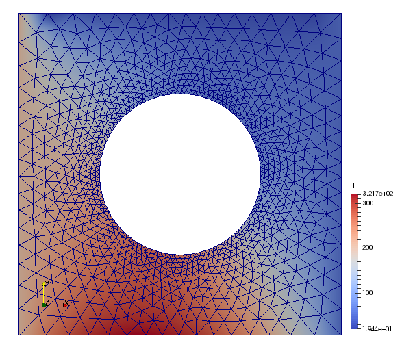

.. _heat1:

Diffusive Heat Transfer
=======================

Objectives
----------

This example demonstrates the use of the ``HeatTransferStep`` method of ``FiniteElementModel`` to solve a diffusive heat transfer problem.

Problem description
-------------------

Consider the heat transfer problem for a plate with a hole. The plate
thickness is 1, and the material is isotropic with a constant thermal
conductivity :math:`k`. There is a distributed heat generation :math:`s(x,y)`
acting throughout the plate. The surface of the hole is insulated, there is a
prescribed temperature at the left and right faces, a prescribed heat flux
into the plate at the bottom face, and a convection boundary condition at the
top face.

.. image:: heat1_1.png
   :align: center
   :scale: 30

Model script
------------

The problem is defined and solved in ``pyfem2`` as follows:

.. code:: python

   """
   pyfem2 tutorial demo program: Diffusive heat transfer.

   """

   from numpy import *
   from pyfem2 import *

   # Create the model problem and read the mesh from a file
   V = FiniteElementModel(jobid='Heat1')
   V.Mesh(filename='PlateWithHoleTria3Fine.g')

   # Define an element block of diffusive heat transfer elements
   # with material 'Material-1'
   V.ElementBlock('Block1', ALL)

   # Create a material and define the thermal conductivity
   mat = V.Material('Material-1')
   mat.IsotropicThermalConductivity(12)
   V.AssignProperties('ElementBlock1', PlaneDiffussiveHeatTransferTria2, mat)

   # Create the load step
   step = V.HeatTransferStep()

   # Fix temperatures on left and right edge
   step.PrescribedBC(ILO, T, 200)
   step.PrescribedBC(IHI, T, 50)

   # Define surface flux on bottom edge of domain
   step.SurfaceFlux(JLO, 2000)

   # Define surface convection on top edge of domain
   Too, h = 25, 250
   step.SurfaceConvection(JHI, Too, h)

   # Define a function specifying the heat generation
   def fun(x):
       return 1000. / sqrt(x[:,0] ** 2 + x[:,1] ** 2)
   step.HeatGeneration(ALL, fun)

   # Solve for the unknown degrees of freedom
   step.run()

   # Write the results to the ExodusII output database
   V.WriteResults()

How does it work?
-----------------

The complete code can be found in the files ``pyfem2/data/Heat1.py``. We now examine the preceding program in detail.

The first lines of the program,

.. code:: python

   from numpy import *
   from pyfem2 import *

import objects from the ``numpy`` and ``pyfem2`` namespaces in to the program.
`numpy <http://www.numpy.org>`__ is a python package providing numerical data
types and procedures. The key import from the ``pyfem2`` library is
the ``FiniteElementModel`` object.

The statement

.. code:: python

   V = FiniteElementModel(jobid='Heat1')

creates the finite element model with identifier ``Heat1``.  The finite element mesh is assigned to the problem by

.. code:: python

   V.Mesh(filename='PlateWithHoleTria3Fine.g')

which reads the mesh definition from a
`ExodusII <http://prod.sandia.gov/techlib/access-control.cgi/1992/922137.pdf>`__ formatted file.  The mesh is composed of 1885 triangular elements

.. image:: heat1_2.png
   :align: center
   :scale: 60

The finite element model ``V`` requires that every element in the mesh be
assigned an element type and material constitutive relations. The assignment
occurs by grouping elements of the same type together in to element blocks and
then assigning to those element blocks material and fabrication properties.
For this problem, every element in the mesh is a ``DiffussiveHeatTransfer2D3``
two-dimensional diffusive heat transfer element. The element block, named
``ElementBlock1``, containing all of the elements in the mesh is created by:

.. code:: python

   V.ElementBlock('ElementBlock1', ALL)

The symbol ``ALL`` informs the ``ElementBlock`` method to assign all elements
in the mesh to the block ``ElementBlock1``. Material properties are defined by
the ``Material`` method and elements in a block are assigned material and
fabrication properties by the ``AssignProperties`` method:

.. code:: python

   mat = V.Material('Material-1')
   mat.IsotropicThermalConductivity(12)
   V.AssignProperties('Block1', PlaneDiffussiveHeatTransferTria3, mat)

The method ``AssignProperties`` takes as input the name of the element block
to which properties are being assigned, the element type for elements in the
block, the material model name, and any element fabrication properties. For
``PlaneDiffussiveHeatTransferTria3`` elements, no fabrication properties are required.

The next step is to define a load step and to it specify the boundary conditions :math:`T(x=-1,y)=200` and
:math:`T(x=1,y)=50`:

.. code:: python

   step = V.HeatTransferStep()
   step.PrescribedBC(ILO, T, 200)
   step.PrescribedBC(IHI, T, 50)

The symbols ``ILO`` and ``IHI`` correspond to the :math:`x` coordinate
direction (``I``) and the identifiers ``LO`` and ``HI`` to the corresponding
low and high boundaries.

The surface flux on the bottom of the domain is defined by

.. code:: python

   step.SurfaceFlux(JLO, 2000)

and the surface convection on top edge by

.. code:: python

   Too, h = 25, 250
   step.SurfaceConvection(JHI, Too, h)

The heat generation in the body of the domain is given by :math:`1000/\sqrt{x^2+y^2}` and is assigned to the model by defining a corresponding function and passing it to the ``HeatGeneration`` method:

.. code:: python

   def fun(x):
       return 1000. / sqrt(x[:,0] ** 2 + x[:,1] ** 2)
   step.HeatGeneration(ALL, fun)

Finally, the unknown temperatures are determined by solving the model and the model results are written to an ExodusII output file

.. code:: python

   step.run()

Perhaps the easiest way to view results is by:

.. code:: python

   V.Plot2D(colorby=V.dofs)

where ``V.dofs`` is the temperature determined from the call to ``step.run()``. The result is

.. image:: heat1_4.png
   :align: center
   :scale: 60

The results can also be written to an ExodusII file and viewed in
`ParaView <http://www.paraview.org>`__

.. code:: python

   V.WriteResults()

